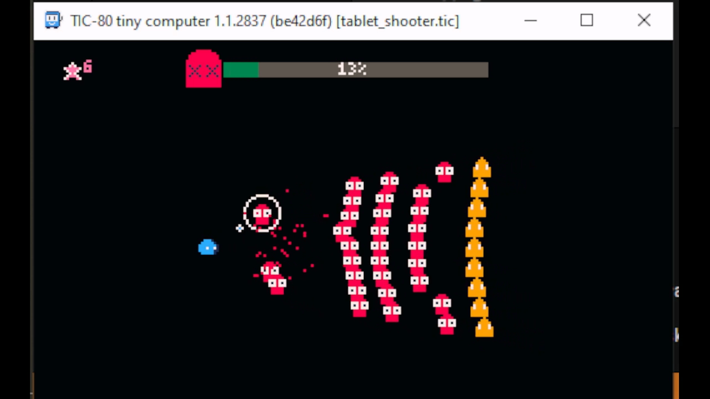
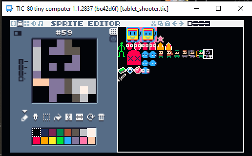

# Tablet Shooter

By Hevanafa, 15-11-2023

This project was meant to be only a prototype with a spritesheet that can possibly be used in the future.

## Features

This project requires at least TIC-80 v1.1, as it is compatible with the ES6 syntax.

The type definition file `tic.d.ts` is already included, but just in case you want to obtain the source code, I've also included the `package.json` file.

The code contains:
- some basic bullets, enemies & particle system
- shooting angle with `atan2`

